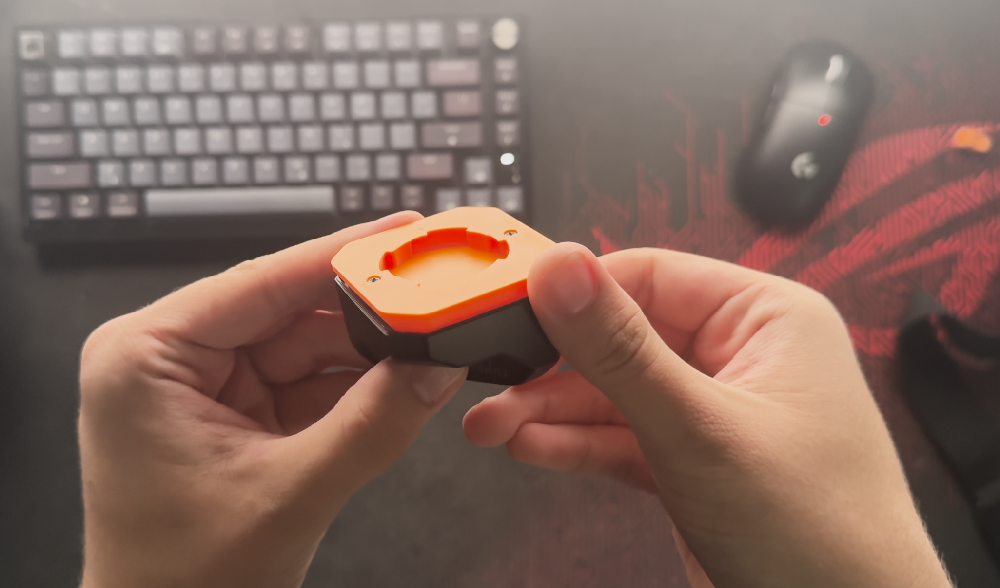
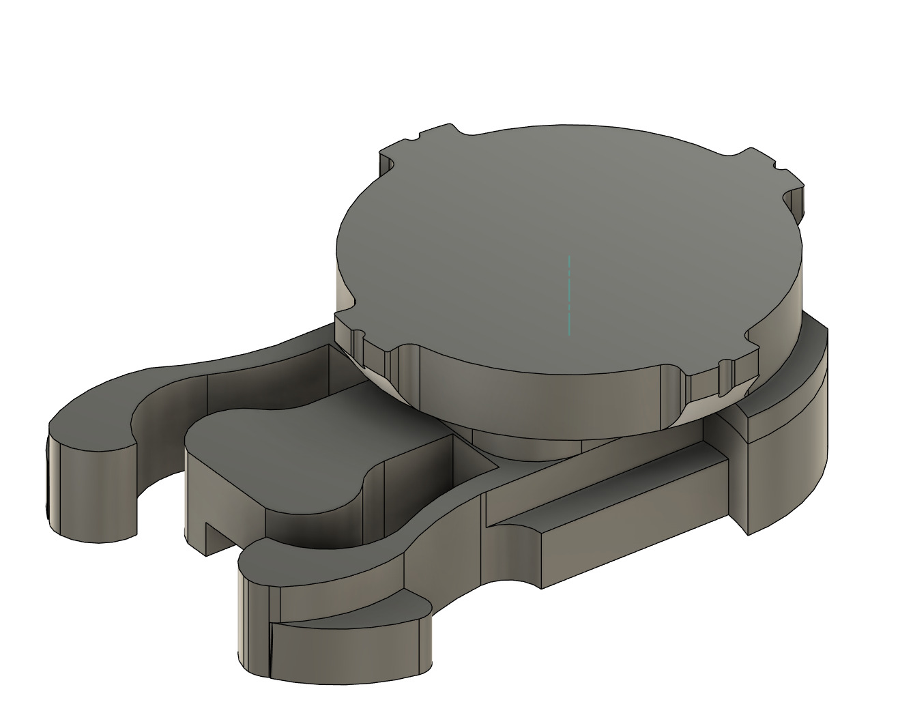

# Quick Mount System for Tundra Trackers

A super simple mounting system for Tundra Trackers that allows for instantaneous attachment and removal of trackers from a selection of mounts.

## See the Quick Mount System in action:

| Base Mount | Shoe Mount | Strap Mount |
|:----------:|:----------:|:-----------:|
|  |  |  |

## Requirements
1. Access to a 3D Printer
2. Print tracker base mount

## 3D Printing

For optimal print quality, print in the orientation shown in the pictures below with a cylindrical support blocker around the mounting system.

To make sure that the locking mechanism works best, print both sides of the mount using the same layer height!

| Print Settings 1 | Print Settings 2 |
|:----------------:|:----------------:|
|  |  |

I personally printed them at a 0.2mm layer height.

## Available Mount Types

Currently, there are two types of mounts. A clip mount and a strap mount

|             Clip Mount              | Strap Mount |
|:-----------------------------------:|:-----------:|
|  |  |

The clip mount is great for chest rigs, and it easily clips in and provides the usage of the quick mount. The strap can be used in many ways, such as threading your shoe laces through the opening, or feeding a strap through it.

## STL Files

The project includes ready-to-print STL files in the `STL/` directory:

- **[QuickMount - Base Model - Tracker Mount.stl](STL/QuickMount%20-%20Base%20Model%20-%20Tracker%20Mount.stl)** - **MUST PRINT** | The core mounting system that provides the foundation for all mounts.
- **[QuickMount - Clip Mount_.stl](STL/QuickMount%20-%20Clip%20Mount_.stl)** - Clip-style mounting solution for versatile attachment
- **[QuickMount - Strap Mount - Updated.stl](STL/QuickMount%20-%20Strap%20Mount%20-%20Updated.stl)** - Updated strap-compatible mounting option

### Base Model Philosophy

The Base Model serves as the foundation that allows anyone to create custom mounts for their specific needs. You can design and attach your own mounting solutions while maintaining compatibility with the quick-release system.

The Fusion 360 source files (`.f3d`) are also included in the `f3d/` directory for those who want to modify or create new mounting configurations.

## Credit

Quick mount system is inspired by this video:
https://www.youtube.com/shorts/wUFzZEljyaI